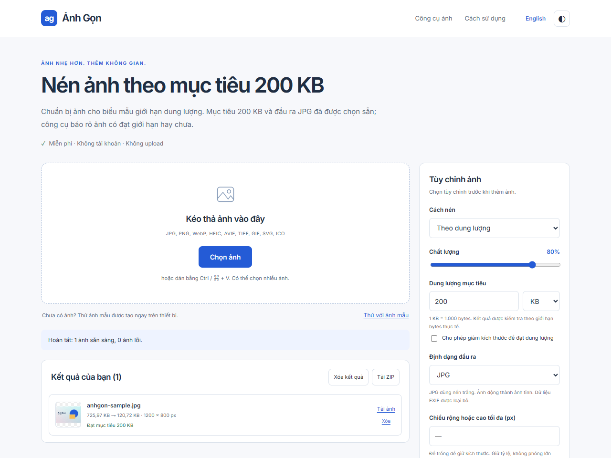

# Demo và nội dung chia sẻ miễn phí

Chuẩn bị 30/09/2026. Các nội dung dưới là draft, chưa đăng vào cộng đồng. Chọn nơi có câu hỏi đúng tác vụ, đọc quy định self-promotion và công khai đây là công cụ do mình phát triển. Không gửi hàng loạt hay đăng link vào câu hỏi không liên quan.

## Demo 1 — ảnh cho biểu mẫu giới hạn 200 KB

1. Mở [Nén ảnh 200 KB](https://anh-gon-vn.netlify.app/nen-anh-200kb/).
2. Chọn “Thử với ảnh mẫu” để người xem kiểm chứng mà không cần gửi ảnh riêng.
3. Chỉ vào dung lượng thật, kích thước pixel và dòng đạt/chưa đạt mục tiêu.
4. Tải JPG; nếu file thực chưa đạt, giảm chất lượng hoặc cho phép giảm kích thước.

Trong QA Chrome, sample 1200 × 800 tạo tại chỗ giảm từ 725,97 KB xuống 120,72 KB. Đây là một ví dụ, không phải tỷ lệ cam kết cho mọi ảnh. WebKit tạo/encode sample khác nên kích thước file khác.

**Draft tiếng Việt**

> Mình phát triển Ảnh Gọn, công cụ nén và đổi định dạng ảnh miễn phí, xử lý ngay trong browser. Có trang chọn sẵn mục tiêu 200 KB cho biểu mẫu, báo dung lượng thật sau xử lý và tải ảnh lẻ hoặc ZIP. Có thể bấm “Thử với ảnh mẫu” trước. Ảnh không được upload; kết quả có thể chưa đạt giới hạn nếu giữ nguyên pixel. Mong nhận phản hồi về thao tác trên điện thoại và chất lượng ảnh sau nén.
>
> https://anh-gon-vn.netlify.app/nen-anh-200kb/

## Demo 2 — HEIC từ iPhone sang JPG

Mở [HEIC→JPG](https://anh-gon-vn.netlify.app/heic-sang-jpg/), dùng HEIC gốc do người làm demo sở hữu, tải JPG rồi kiểm tra chiều ảnh và khả năng mở file. Không dùng ảnh riêng của người khác trong screenshot/video. Giải thích decoder tải ở lần đầu; chưa cam kết mọi biến thể HEIC đều hỗ trợ.

## Demo 3 — batch cho ảnh website

Mở [Convert to WebP](https://anh-gon-vn.netlify.app/en/convert-to-webp/), chọn kích thước tối đa theo nhu cầu, thêm một batch nhỏ, kiểm tra kết quả rồi tải ZIP. Nếu cần JPG cho ứng dụng không nhận WebP, dùng [WebP→JPG](https://anh-gon-vn.netlify.app/en/webp-to-jpg/).

**English draft**

> I built AnhGon, a free browser tool for compressing and converting images in batches. Images stay on your device; there is no account or upload step. It includes a 200 KB target, HEIC to JPG, WebP conversion and ZIP downloads. You can try a locally generated sample first. The tool reports actual output sizes, including when it cannot meet a target. I'd appreciate feedback on mobile usability and output quality.
>
> https://anh-gon-vn.netlify.app/en/

Mobile screenshot dùng Playwright WebKit với iPhone 15 emulation; không phải ảnh chụp iPhone thật: [xem demo mobile](../.github/images/anhgon/mobile-en.png).

## Đo kết quả khi đã có dữ liệu

- Search Console: Page indexing, query, country, device, impressions, clicks và CTR theo page/language.
- Từng lần chia sẻ: ghi ngày, URL bài và phản hồi cụ thể vào nhật ký dưới. Chưa có analytics nên không gán traffic hoặc conversion cho bài đăng.
- Khi có query lặp lại cho resize/PNG→JPG hoặc một ngôn ngữ mới, review trước khi mở rộng. Chưa đủ dữ liệu để ưu tiên thêm quốc gia.

| Ngày | Nơi chia sẻ / URL | Tác vụ | Phản hồi / thay đổi cần làm |
|---|---|---|---|
| Chưa đăng | — | — | Draft và demo đã chuẩn bị |
